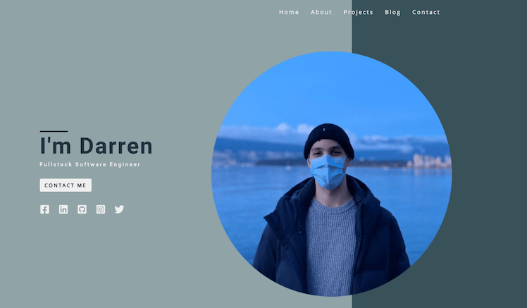

# Personal Website/Portfolio

## To Develop

### GatsbyJS
* `npm install -g gatsby-cli`
* `gatsby develop`
* Navigate to: `localhost:8000`
* GraphiQL available at: `localhost:8000/__graphql`

### Strapi Server
* From the 'personal-website-api' project run: `yarn && yarn develop`
* Navigate to: `localhost:1337/admin`
* Login

## To Deploy
* Make sure Strapi Server is running with `yarn develop`
* In the project repo run: `gatsby clean && gatsby build`
* Drag and drop the `public` folder to Netlify

## Main Features
* Semantic HTML
* Icon packs from [React icons](https://react-icons.github.io/react-icons) and [React Simple Icons](https://github.com/icons-pack/react-simple-icons)

## How it works
* Site is statically generated using GatsbyJS
* Data is managed and fetched from a Headless CMS ([Strapi.io](https://strapi.io/))
* SEO is configured by `gatsby-plugin-sitemap` and the `SEO.js` component which extracts the siteMetadata from gatsby-config

## Special Thanks
Special thanks to [John Smilga](https://www.johnsmilga.com/) who provided a tutorial on the initial implementation of this project in Gatsby and Strapi.\
[Gatsby - Strapi Portfolio Project](https://www.youtube.com/watch?v=asB-dUwpH4Y)